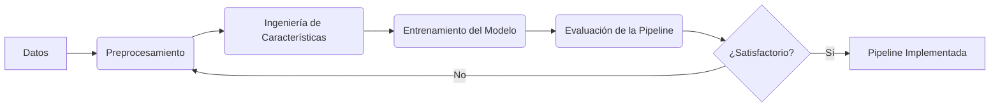

# Pipelines de Machine Learning 🤖

Este proyecto contiene pipelines de machine learning para el procesamiento de datos 💾 y el entrenamiento de modelos 🧠.

## Estructura del Proyecto 📂

```
.
├── data/
│   └── dataset.parquet
├── notebooks/
│   ├── experimentos.ipynb
│   ├── fetch_data.ipynb
│   └── split_dataset.ipynb
├── pipelines/
│   └── best_pipeline.pkl
├── pyproject.toml
├── README.md
├── src/
│   └── feature_engineering.py
└── uv.lock
```

- `data/`: Contiene los archivos del conjunto de datos en formato Parquet.
- `notebooks/`: Contiene cuadernos de Jupyter para la obtención de datos 📊, la división del conjunto de datos y los experimentos 🧪.
  ```text
  /notebooks:
  - fetch_data.ipynb
  - split_dataset.ipynb
  - experimentos.ipynb
  ```
- `pipelines/`: Contiene el mejor modelo de pipeline en formato pickle ⚙️.
  ```text
  /pipelines:
  - best_pipeline.pkl
  ```
- `src/`: Contiene el código fuente para la ingeniería de características ✨.
  ```text
  /src:
  - feature_engineering.py
  ```

## Uso 🚀

1. Clona el repositorio.
2. Instala las dependencias requeridas usando `uv install`.
3. Ejecuta los cuadernos de Jupyter en el directorio `notebooks/` para obtener datos, dividir el conjunto de datos y realizar experimentos.
4. Utiliza el script `src/feature_engineering.py` para la ingeniería de características.
5. El mejor modelo de pipeline se guarda en `pipelines/best_pipeline.pkl`.

## Mapa Conceptual 🗺️

A continuación, se presenta un mapa conceptual del proyecto:



## Contribución 🙌

¡Las contribuciones son bienvenidas! Por favor, abre un issue o envía un pull request.

## Licencia 📜

Este proyecto está licenciado bajo la Licencia MIT.